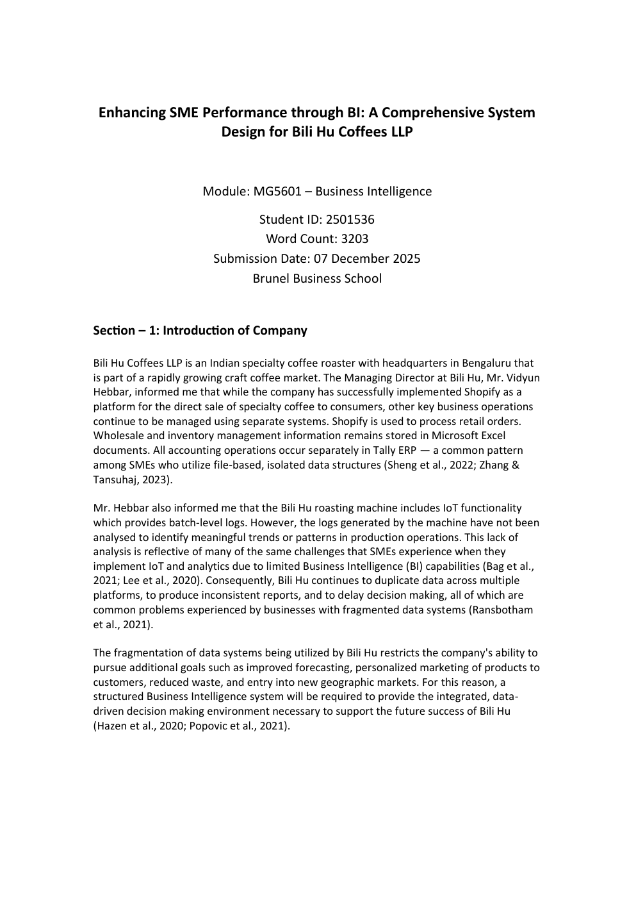
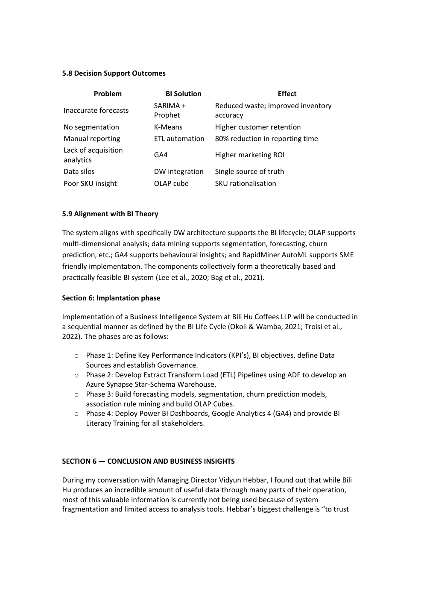
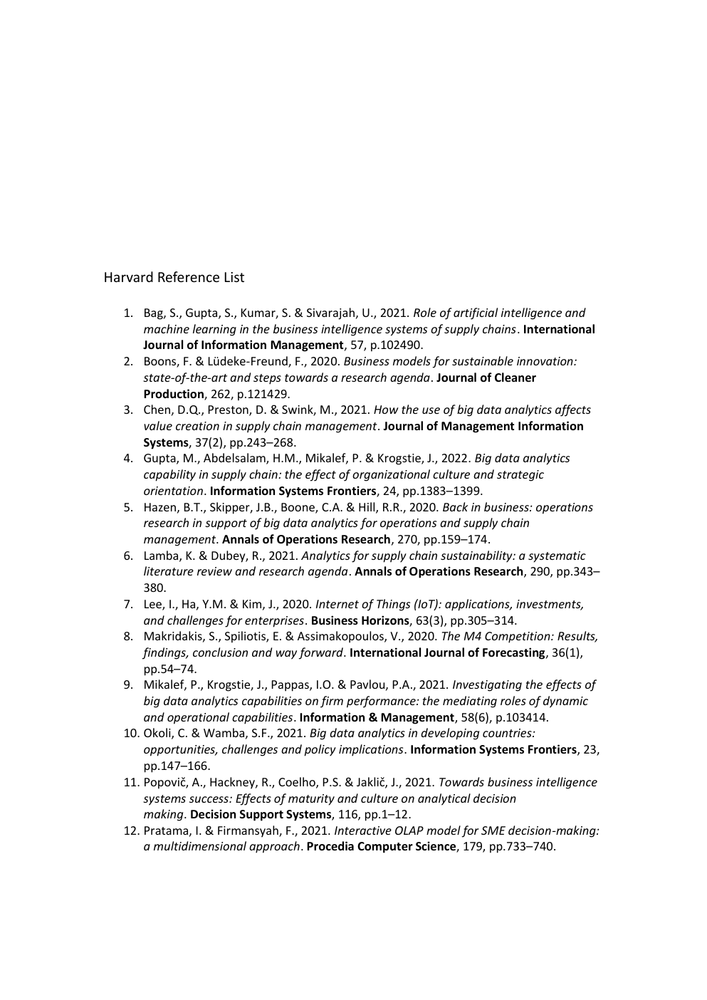

# Bili Hu Coffees — Business Intelligence System Design

> **Brunel University London | MG5601 Business Intelligence**

A business intelligence system design and analytics showcase for **Bili Hu Coffees LLP**, an Indian specialty coffee roaster. The project addresses fragmented Shopify, Excel, Tally ERP and IoT roasting data through a proposed integrated BI architecture and a dashboard prototype.

## Project Overview

The business case identified fragmented data, manual reconciliation, weak demand forecasting, limited customer analytics and limited production-quality analysis as key decision-support challenges. The proposed solution combines data integration, ETL automation, a data warehouse, OLAP, predictive analytics and dashboard-based insights.

## What This Repository Demonstrates

- Business problem identification and requirements analysis
- BI system architecture and data integration design
- Proposed Azure Synapse data warehouse and Azure Data Factory ETL architecture
- OLAP and multidimensional analysis
- Demand forecasting using SARIMA / Prophet concepts
- RFM customer segmentation and churn-risk analysis
- SKU and profitability analytics
- IoT roast-quality monitoring
- Market-basket / association-rule analysis
- Power BI dashboard design and management KPI reporting

## Dashboard Showcase

Open [`dashboard.html`](dashboard.html) locally in a browser to explore the dashboard prototype.







## Key Decision-Support Outcomes

The project maps business problems to proposed analytical interventions, including:

| Business problem | BI / analytics response |
|---|---|
| Inaccurate forecasts | SARIMA + Prophet forecasting |
| Limited customer segmentation | K-Means / RFM analytics |
| Manual reporting | ETL automation |
| Data silos | Data warehouse integration |
| Weak SKU insight | OLAP analysis |
| Limited acquisition analytics | GA4 / digital behaviour analytics |

The coursework describes an expected **80% reduction in reporting time** from ETL automation and identifies improvements in inventory accuracy, retention, SKU rationalisation and decision support as intended outcomes.

## Architecture

```text
Shopify ─┐
Excel ───┤
Tally ───┼──> Proposed ETL / Integration ──> Azure Synapse DW ──> OLAP / Analytics ──> Power BI
IoT ─────┤                         │
GA4 ─────┘                         ├── Forecasting
                                  ├── Segmentation
                                  ├── Churn Risk
                                  └── Association Rules
```

## Repository Contents

- `Bili_Hu_BI_Project_Report.pdf` — full academic project report
- `dashboard.html` — interactive dashboard prototype
- `assets/` — selected project visuals used in this README

## Important Scope Note

This repository distinguishes between **proposed system architecture** and **analytical/dashboard prototype work**. The report proposes the Azure Synapse and Azure Data Factory implementation as part of the BI solution; it should not be represented as a production deployment unless separately verified.

## Skills

`Business Intelligence` `Power BI` `Python` `Predictive Analytics` `Data Analytics` `Data Warehousing` `ETL` `OLAP` `Customer Segmentation` `Churn Analysis`

## Academic Context

**Module:** MG5601 – Business Intelligence  
**Institution:** Brunel Business School  
**Submission:** December 2025

---

### Author
**Mark Maxwel Louis**  
M.Sc. Accounting & Business Intelligence — Brunel University London
